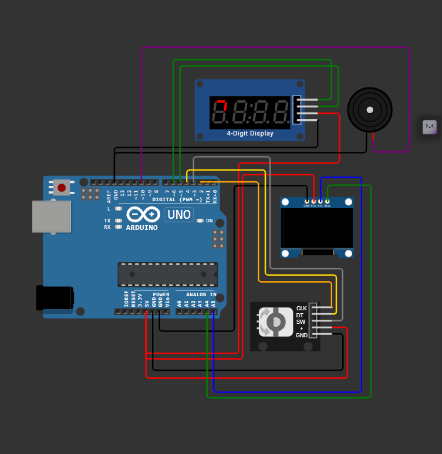
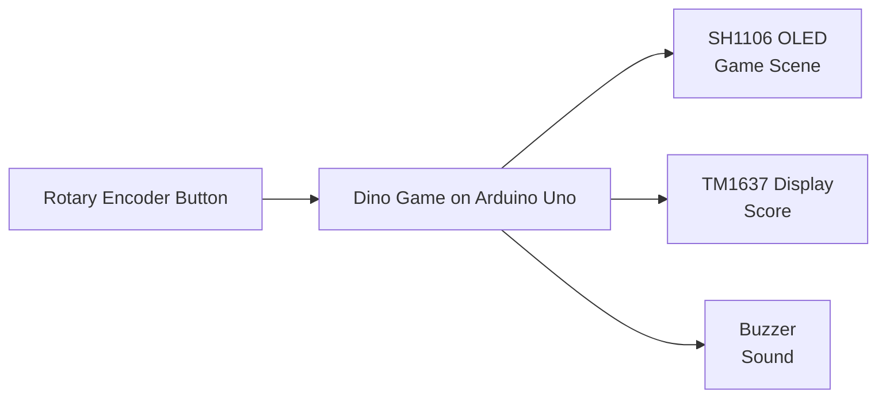
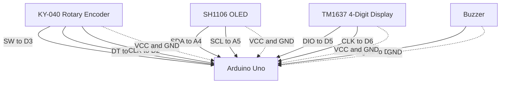
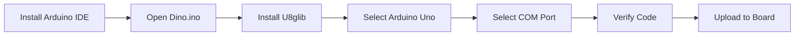
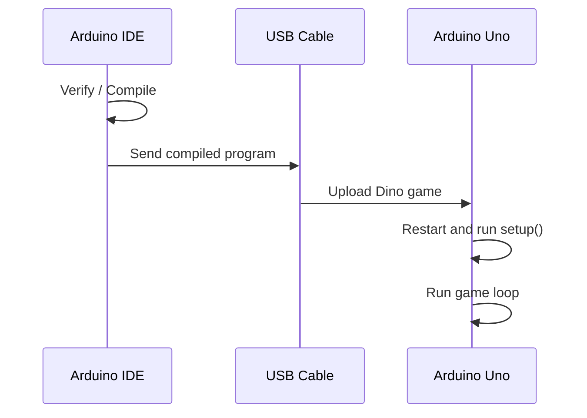
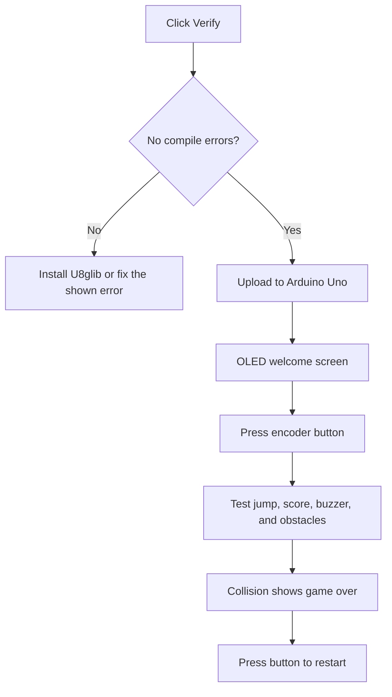

# Arduino Dino Game

This is a Chrome-Dino-style game for an Arduino Uno. The OLED shows the game, the TM1637 display shows the score, the rotary encoder button makes the Dino jump, and the buzzer produces game sounds.

## 🖼️ Circuit & Components Overview

Below is the complete wiring diagram setup for the project:



### Key Hardware Used
- **Arduino Uno R3**
- **128x64 OLED Display (I2C)**
- **TM1637 4-Digit Segment Display**
- **KY-040 Rotary Encoder**
- **Piezo Buzzer**

## What You Need

- Arduino Uno
- USB data cable
- SH1106 128x64 OLED display
- TM1637 four-digit display
- KY-040 rotary encoder
- Buzzer
- Jumper wires and a breadboard
- Arduino IDE

## How the Project Works



## Wiring

Connect the components exactly as shown below before powering the board.

| Component | Component Pin | Arduino Uno Pin |
| --- | --- | --- |
| Rotary encoder | SW | D3 |
| Rotary encoder | DT | D4 |
| Rotary encoder | CLK | D2 |
| Rotary encoder | VCC | 5V |
| Rotary encoder | GND | GND |
| TM1637 display | DIO | D5 |
| TM1637 display | CLK | D6 |
| TM1637 display | VCC | 5V |
| TM1637 display | GND | GND |
| Buzzer | Signal / positive | D10 |
| Buzzer | GND / negative | GND |
| OLED | SDA | A4 |
| OLED | SCL | A5 |
| OLED | VCC | 5V |
| OLED | GND | GND |

### Wiring Image



## Arduino IDE: Install and Prepare

### 1. Install Arduino IDE

1. Download and install Arduino IDE from the official Arduino website.
2. Open Arduino IDE after installation.
3. Use a USB **data cable**, not a charge-only cable.

### 2. Create the Correct Project Folder

Arduino IDE sketches must be inside a folder with the same name as the `.ino` file.

Create this folder structure:

```text
Dino/
├── Dino.ino
├── TM1637Display.cpp
├── TM1637Display.h
└── README.md
```

In Arduino IDE, select **File > Open**, open the `Dino.ino` file, and keep all three source files in the same `Dino` folder.

### 3. Install the Required Library

1. Open **Sketch > Include Library > Manage Libraries**.
2. Search for `U8glib`.
3. Install the library named **U8glib**.
4. Close and reopen Arduino IDE if the library is not detected immediately.

The local `TM1637Display.cpp` and `TM1637Display.h` files are already included in this project. They do not need to be installed separately.

## Arduino IDE: Select the Board and Port

1. Connect the Arduino Uno to the computer.
2. Open **Tools > Board > Arduino AVR Boards > Arduino Uno**.
3. Open **Tools > Port** and select the port labelled `Arduino Uno`.
4. On Windows, the port can be checked in **Device Manager > Ports (COM & LPT)**.



## Upload the Code Step by Step

1. Open `Dino.ino` in Arduino IDE.
2. Confirm that `TM1637Display.cpp` and `TM1637Display.h` are in the same folder.
3. Select the Arduino Uno board.
4. Select the correct COM port.
5. Click the checkmark button, or choose **Sketch > Verify/Compile**.
6. Wait for the message `Done compiling`.
7. Click the right-arrow **Upload** button, or choose **Sketch > Upload**.
8. Wait for `Done uploading`.
9. The Arduino Uno will restart and the game will begin on the OLED.

### Upload Process Image



## How to Test the Project

Test the project in this order after uploading the code:

### 1. Compile Test

1. Open `Dino.ino` in Arduino IDE.
2. Click **Verify**.
3. The bottom panel must show `Done compiling` without red errors.

### 2. Power and Display Test

1. Keep the Arduino connected by USB.
2. The OLED should show `Welcome to Dino!!` and `Push to begin`.
3. The TM1637 display should be on and ready to show the score.
4. If the OLED is blank, turn off power and recheck `SDA`, `SCL`, `VCC`, and `GND`.

### 3. Button and Game Test

1. Press the rotary encoder button once.
2. The welcome screen should change to the running game.
3. Press the button again while the Dino is running.
4. The Dino should jump and the buzzer should make a short sound.

### 4. Score and Obstacle Test

1. Leave the Dino running without pressing the button.
2. The number on the TM1637 display should increase.
3. The cactus obstacles should move from right to left on the OLED.
4. Let the Dino hit an obstacle.
5. The OLED should show the game-over screen and the buzzer should sound.

### 5. Restart Test

1. Press the rotary encoder button after game over.
2. The welcome screen should appear again.
3. Start the game once more and confirm that the score starts from zero.



## If Arduino IDE Is Idle or Upload Does Not Start

If the IDE is open but nothing is happening, check these items in order:

1. Make sure the USB cable supports data transfer.
2. Check that the Arduino power light is on.
3. Select **Arduino Uno** under **Tools > Board**.
4. Select the correct COM port under **Tools > Port**.
5. Close Serial Monitor before uploading.
6. Press the Arduino Uno reset button once, then upload again.
7. Disconnect and reconnect the USB cable.
8. If the COM port is missing, install the USB driver used by your Arduino board.
9. Compile first with **Verify**. Fix any error shown in the bottom output panel before uploading.

## Playing the Game

1. Press the rotary encoder button to start.
2. Press the same button while playing to jump.
3. Avoid the cactus obstacles.
4. The score increases while the Dino survives.
5. After a collision, press the button to return to the start screen.

## Project Files

- `Dino.ino`: game states, animation, collision detection, score, input, and sound.
- `TM1637Display.h`: interface for the local TM1637 score-display driver.
- `TM1637Display.cpp`: communication and digit encoding for the TM1637 display.
- `README.md`: wiring and Arduino IDE instructions.

## Common Errors

### `U8glib.h: No such file or directory`

Install `U8glib` from **Sketch > Include Library > Manage Libraries**, then compile again.

### `TM1637Display.h: No such file or directory`

Move `TM1637Display.cpp` and `TM1637Display.h` into the same folder as `Dino.ino`.

### `avrdude: ser_open() access is denied`

Close Serial Monitor and any other program using the COM port. Select the correct port and upload again.

### The OLED is blank

Turn off the Arduino, recheck SDA, SCL, VCC, and GND wiring, then power it on again.


